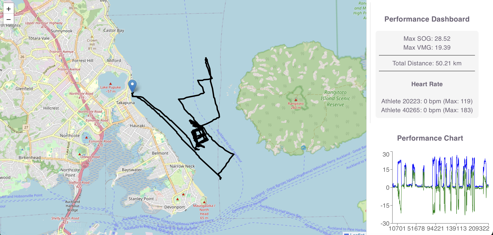

# GPS Backend API

This is a simple backend API built with .NET 8 that reads GPS tracking data from a JSON file and processes it. 
It calculates metrics like Maximum speed, VMG, and heart rate, then returns everything through an API.

---

## What this project does

- Reads GPS data from a JSON file
- Calculates:
  - Maximum Speed Over Ground (SOG)
  - Maximum Velocity Made Good (VMG)
  - Maximum Heart Rate (HR)
- Prepares data for charts
- Returns all results through an API

---

##  Project structure

Controllers/ → Handles API requests
Services/ → Contains logic (calculations, processing)
Repositories/ → Reads data from JSON file
DTOs/ → Data models
Configuration/ → App settings (file path, etc.)

## Screenshot

### GPS Dashboard Application


---

## Setup

### Requirements
- .NET 8 SDK

### Run the backend project

dotnet run


## GPS Frontend - React Application

---

## Overview

This is a React frontend for the GPS Backend API.  
It displays GPS tracking data in a simple dashboard with charts, maps, statistics.

The app connects to a .NET backend and shows results like Maximum SOG, VMG, and HR.

---

## End-to-End Flow

1. The frontend loads in the browser  
2. It requests data from the backend API  
3. Axios handles the request  
4. Backend returns processed GPS data  
5. Data is passed to UI components  
6. The dashboard displays:
   - Charts
   - Map view
   - Stats
   - Summary  

---
## Features

- Charts for performance tracking  
- Map view for GPS route visualization  
- Stats for SOG, VMG, HR  
- Summary of trip data  

---

## Tech Stack

- React  
- Axios  
- Docker  
- REST API integration  


## Project Structure

- API Layer → `getapi.js` (handles backend calls)  
- HTTP Client → `httpClient.js` (Axios setup + interceptors)  
- Components:
  - `ChartPanel.jsx` → performance charts  
  - `MapView.jsx` → GPS route display  
  - `StatsPanel.jsx` → SOG, VMG, HR values  
  - `SummaryPanel.jsx` → trip summary  
- App Layer → combines all components into dashboard  

---

### Run the backend project

npm run dev 

## Docker Setup

Run full stack using Docker Compose:

```bash
docker compose up --build


